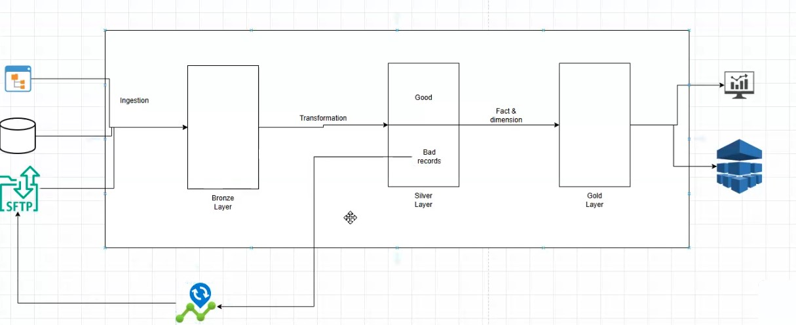

# Customer360 Data Pipeline: From Raw to Insights

## 📌 Project Overview
The **Customer360 Data Pipeline** is an end-to-end ETL solution built on PySpark that processes customer-related data from raw ingestion to business-ready insights. The pipeline extracts data from multiple sources, applies necessary transformations in three distinct layers (**Bronze, Silver, and Gold**), and stores the transformed data into **Parquet** for analysis.

### 🚀 Key Features:
✅ **Ingest** raw data from CSV files.
✅ **Transform** and enrich data in the **Silver layer**.
✅ **Aggregate** and prepare data for business insights in the **Gold layer**.

---

## 📌 Architecture
The pipeline follows the **Lakehouse architecture pattern**, which consists of three layers:



1. **Bronze Layer (Raw Data Storage):**
   - Ingest raw customer transaction and profile data into **Google Cloud Storage (GCS)**.

2. **Silver Layer (Data Transformation):**
   - Use **Apache Beam & Google Cloud Dataflow** to clean, validate, and enrich the data.
   - Process and prepare data for analytics.

3. **Gold Layer (Aggregated Insights):**
   - Transform data into analytical views in **BigQuery**, providing business-ready datasets.

---

## 📌 Input Datasets

### 1. Customer Transactions
📂 **Fields:** `transaction_id, customer_id, transaction_date, amount, category`
📂 **Source:** CSV File ([Dataset Link](https://docs.google.com/spreadsheets/d/1U5esDcKDWzbEothjo9RXPmK5dcaYTgyc6DOPceSjLGk/edit?usp=sharing))

### 2. Customer Profiles
📂 **Fields:** `customer_id, name, email, signup_date`
📂 **Source:** CSV File ([Dataset Link](https://docs.google.com/spreadsheets/d/1Yk8YLIf87tHvKaz5D5O9N6JoUZZPZqM_wnjih_3EP_0/edit?usp=sharing))

---

## 📌 ETL Pipeline Stages

### 1. Bronze Layer (Raw Data Storage)
🛠 **Purpose:** Ingest raw CSV files into **Google Cloud Storage (GCS)**.
📌 **Location:**
   - **Bucket Name:** `customer360`
   - **File Path:** `bronze_layer/<date>/<dataset_name>/<file_nm>`

### 2. Silver Layer (Data Transformation)
🛠 **Purpose:** Clean, validate, and enrich data using **PySpark**.
🚀 **Transformations:**
- Remove duplicates (ensuring each date has a unique row ID).
- Clean invalid or missing values.
- Enrich data with additional fields:
  - `is_large_transaction` (for transactions > $1000).
  - `year, month, day` for easier aggregation.
  - Standardize **category** and **email** fields.
- Validate email domains (must end with `.com` or `.net`).
- Write the clean data to **BigQuery**.

### 3. Gold Layer (Aggregated Data)
🛠 **Purpose:** Perform business-level aggregations and generate curated datasets for analysis.
📊 **Aggregations:**
✅ **Total Spending Per Customer**: Aggregate transaction amounts by customer.
✅ **Top Categories by Spending**: Identify the most popular spending categories.
✅ **Customer Profile with Spending**: Merge profile and transaction data.

---

## 📌 Orchestration with Cloud Composer
The entire ETL pipeline is **orchestrated** using **Cloud Composer**, which manages task dependencies and ensures smooth execution.

🔹 **Step 1:** Ingest Data to **Bronze Layer** (Upload CSV files to GCS).
🔹 **Step 2:** Run **Dataflow Job** to process and clean data into the **Silver Layer**.
🔹 **Step 3:** Execute **BigQuery SQL** queries to produce **Gold Layer** datasets.

---

## 📌 Technology Stack
- **Google Cloud Platform (GCP)**
  - **Google Cloud Storage (GCS)** - Storage for raw CSV files (Bronze Layer).
  - **Google Cloud Dataflow (Apache Beam)** - Data transformation & processing (Silver Layer).
  - **BigQuery** - Storage & querying for transformed/aggregated datasets (Silver & Gold Layers).
  - **Cloud Composer** - ETL job orchestration & task scheduling.

---

## 📌 Key Benefits
✅ **Scalability:** Handles growing data using GCP's serverless architecture.
✅ **Data Quality:** Ensures clean, validated, and enriched data.
✅ **Flexibility:** Supports multiple input data types & transformation rules.
✅ **Real-Time Processing:** Can be modified to support real-time streaming data.

---

## 📌 Getting Started
### 🔧 Prerequisites
- Python 3.x
- PySpark
- Google Cloud SDK
- BigQuery Python Client Library

### 🚀 Setup
1. Clone the repository:
   ```sh
   git clone https://github.com/your-username/customer360-data-pipeline.git
   cd customer360-data-pipeline
   ```
2. Install dependencies:
   ```sh
   pip install -r requirements.txt
   ```
3. Configure Google Cloud credentials:
   ```sh
   export GOOGLE_APPLICATION_CREDENTIALS='path_to_your_service_account.json'
   ```
4. Run the pipeline:
   ```sh
   python etl_pipeline.py
   ```
---
